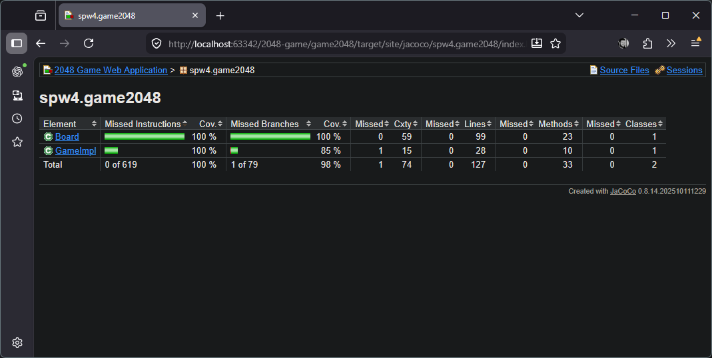

# 2048


## Anmerkungen zum Projekt
### Tool-Auswahl

Für Branch- und Testabdeckung wurde `jacoco` verwendet.

### Coverage
Die Testabdeckung für `Board` und `GameImpl` ist 100%. Die Branch-Abdeckung ist bei `GameImpl` nur bei 85%, da hier ein Case-Statement für die Eingabe der Richtung nicht mit default-Fall ausgeführt werden kann. Der Eingabe-Parameter ist vom Typ `direction` und kann somit nur die Werte aus diesem Enum annehmen.

```java 
switch (direction) {
    case up: {
        board.moveUp();
        break;
    }
    case down: {
        board.moveDown();
        break;
    }
    case left: {
        board.moveLeft();

        break;
    }
    case right: {
        board.moveRight();
        break;
    }
}
```



> Der Report wird beim Build automatisch generiert, anzeigen lässt er sich am besten über den internen Webserver von IntelliJ. 
## CI/CD Setup

Um den docker container für den Runner zu starten:
```bash
docker network create runner-net

docker run --rm -d \
  --name github-runner \
  --network runner-net \
  -p 8081:8080 \
  tomcat:9-jdk17-openjdk-slim
  ```

Danach per docker `exec -it github-runner bash` eine `tty`-Session im Container starten und das Setup, wie im Readme beschrieben, ausführen.

Base-Setup:
```bash
apt update
apt upgrade -y
apt install -y maven curl git tar

chmod 777 /usr/local/tomcat/webapps

adduser github-runner
su -l github-runner
```
 
installation github-runner lt. Gihub-Dokumentation:
```bash
# Create a folder
$ mkdir actions-runner && cd actions-runner
Copied!
# Download the latest runner package
$ curl -o actions-runner-linux-x64-2.334.0.tar.gz -L https://github.com/actions/runner/releases/download/v2.334.0/actions-runner-linux-x64-2.334.0.tar.gz
# Optional: Validate the hash
$ echo "048024cd2c848eb6f14d5646d56c13a4def2ae7ee3ad12122bee960c56f3d271  actions-runner-linux-x64-2.334.0.tar.gz" | shasum -a 256 -c
# Extract the installer
$ tar xzf ./actions-runner-linux-x64-2.334.0.tar.gz
Configure
# Create the runner and start the configuration experience
$ ./config.sh --url https://github.com/mstoebich/spw4-2048 --token <Token>
Copied!
# Last step, run it!
$ ./run.sh
Using your self-hosted runner
# Use this YAML in your workflow file for each job
runs-on: self-hosted
```